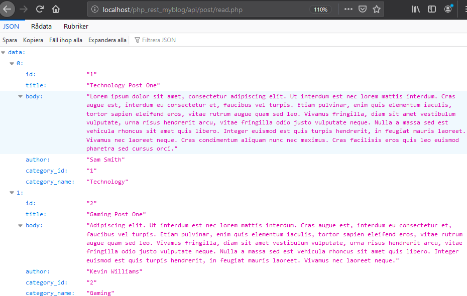

# PHP REST API For a blog.

## Introduction
A basic CRUD REST API for a simple Blog. Written in PHP for practice purposes. The API let's you perform basic CRUD operations on the two tables available in the included myblog.sql file.

## Project Setup
You'll need some kind of XAMPP-stack or equivalent so that you can create the database for the project. You might also find it helpful to use Postman to send the requests.

1. Create a new MySQL database and import the myblog.sql file included in the project.
2. Clone or import the repository in to the htdocs folder (or the equivalent folder for your ammp-stack).
3. Update the database information in the Database.php file located in the Config folder. So that it matches your database information.
4. After the setup is complete, the URL to the API should look something like this: **localhost/your_folder_name/api/**.

## Endpoints
To preform the CRUD operations you'll need to send your request to the following endpoints.

### Posts
##### Read
  * Get all the posts from the Posts table.
  * Method Get-request.
  * Endpoint: **localhost/your_folder_name/api/post/read.php**
##### Read Single
  * Get the post with the given ID.
  * Method Get-request. Send the ID number (INT) as a parameter.
  * Endpoint: **localhost/your_folder_name/api/post/read_single.php?id=theID**
  * Example: Get the post with ID #2. **localhost/your_folder_name/api/post/read_single.php?id=2**
##### Create Post
  * Method POST, Content-Type: application/json. Send Body as a raw json object.
  * Endpoint: **localhost/your_folder_name/api/post/create.php**
  * Example Raw Body Data: 
    {
        "title": "Post Title",
        "body": "Post Body Content"
        "author": "Author Name",
        "category_id": "Category id"
    }
##### Update Post
  * Method PUT, Content-Type: application/json. Send the post id as a raw json object in the request body.
  * Endpoint: **localhost/your_folder_name/api/post/update.php**
  * Example RAW Data: 
    {
        "id": "1"
    }
##### Delete Post
  * Method DELETE, Content-Type: application/json. Send the post id as a raw json object in the request body.
  * Endpoint: **localhost/your_folder_name/api/post/delete.php**
  * Example RAW Data: 
    {
        "id": "1"
    }

### Categories
##### Read
  * Get all the categories from the categories table.
  * Method Get-request.
  * Endpoint: **localhost/your_folder_name/api/category/read.php**
##### Read Single
  * Get the category with the given ID.
  * Method Get-request. Send the ID number (INT) as a parameter.
  * Endpoint: **localhost/your_folder_name/api/category/read_single.php?id=theID**
  * Example: Get the category with ID #2. **localhost/your_folder_name/api/category/read_single.php?id=2**
##### Create category
  * Method POST, Content-Type: application/json. Send Body as a raw json object.
  * Endpoint: **localhost/your_folder_name/api/category/create.php**
  * Example Raw Body Data: 
    {
        "name": "Category Name"
    }
##### Update Category
  * Method PUT, Content-Type: application/json. Send the category id as a raw json object in the request body.
  * Endpoint: **localhost/your_folder_name/api/category/update.php**
  * Example RAW Data: 
    {
        "id": "1"
    }
##### Delete category
  * Method DELETE, Content-Type: application/json. Send the category id as a raw json object in the request body.
  * Endpoint: **localhost/your_folder_name/api/category/delete.php**
  * Example RAW Data: 
    {
        "id": "1"
    }
